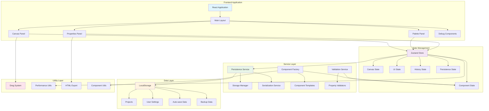
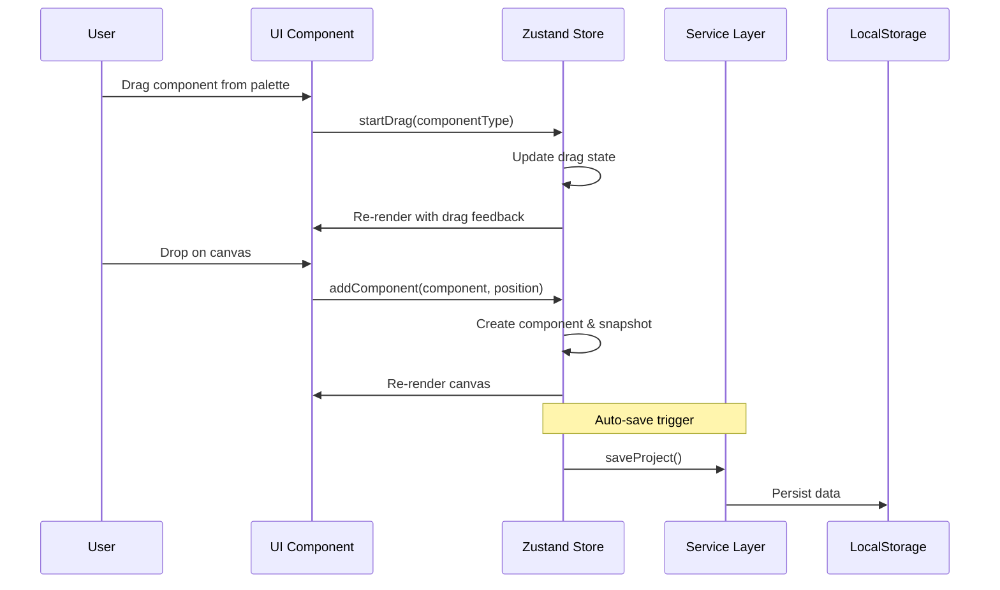
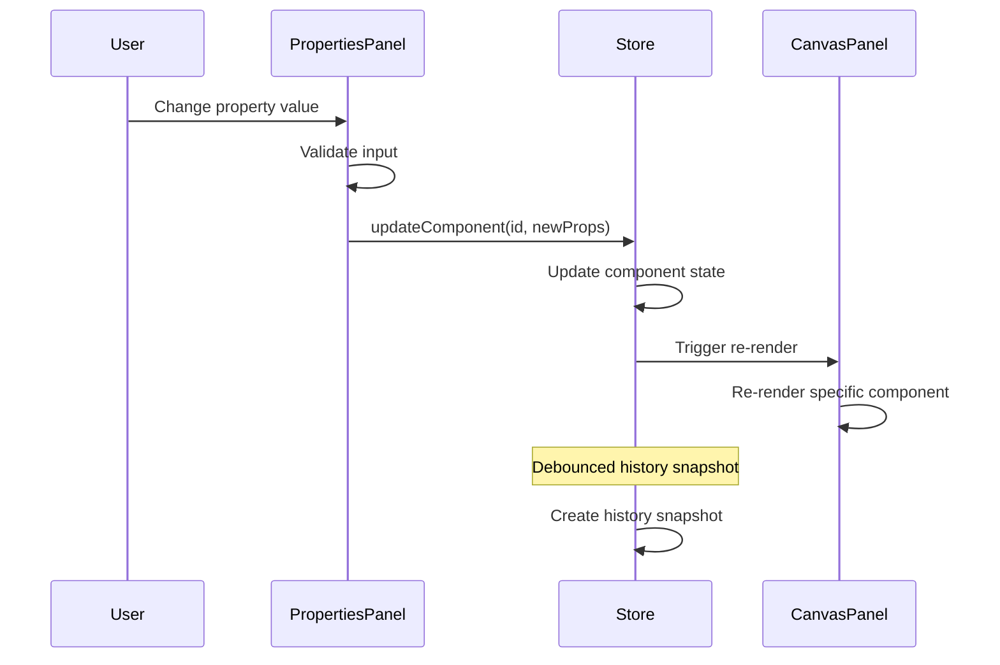
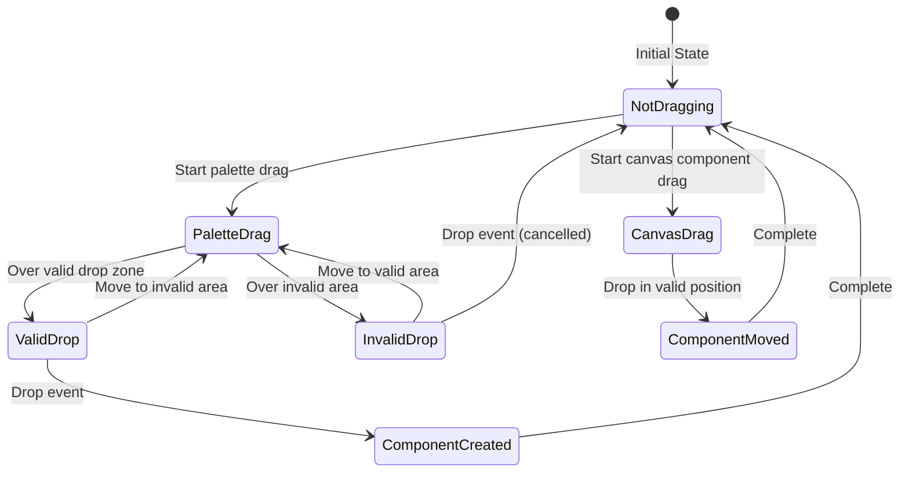

# Aura NoCode Editor - Architecture Documentation

## Table of Contents

1. [Executive Summary](#executive-summary)
2. [Architectural Pattern](#architectural-pattern)
3. [System Architecture Overview](#system-architecture-overview)
4. [Technology Justification](#technology-justification)
5. [State Management Strategy](#state-management-strategy)
6. [Component Structure Design](#component-structure-design)
7. [Undo/Redo Implementation](#undoredo-implementation)
8. [Communication Flows](#communication-flows)
9. [Performance Considerations](#performance-considerations)
10. [Security & Data Integrity](#security--data-integrity)
11. [Scalability & Extensibility](#scalability--extensibility)

## Executive Summary

The Aura NoCode Editor is a sophisticated drag-and-drop visual content creation platform built with modern web technologies. This document outlines the architectural decisions, design patterns, and implementation strategies that enable the editor to deliver a performant, reliable, and extensible user experience.

**Key Design Principles:**

- **Separation of Concerns**: Clear boundaries between presentation, business logic, and data layers
- **Type Safety**: Comprehensive TypeScript implementation for reliability
- **Performance First**: Optimized state management and selective re-rendering
- **Offline-First**: Local storage with robust serialization for immediate responsiveness
- **Extensibility**: Plugin-ready architecture for future enhancements

## Architectural Pattern

### Selected Pattern: Layered Architecture with Service-Oriented Design

We chose a **Layered Architecture** combined with **Service-Oriented Design** principles for the following reasons:

#### 1. **Clear Separation of Concerns**

```
┌─────────────────────────────────────┐
│         Presentation Layer          │  ← React Components, UI Logic
├─────────────────────────────────────┤
│       State Management Layer        │  ← Zustand Store, Actions, Selectors
├─────────────────────────────────────┤
│         Service Layer              │  ← Business Logic, Data Processing
├─────────────────────────────────────┤
│          Data Layer                │  ← Storage, Serialization
└─────────────────────────────────────┘
```

#### 2. **Why This Pattern?**

**Advantages:**

- **Maintainability**: Each layer has distinct responsibilities, making the codebase easier to understand and modify
- **Testability**: Layers can be tested in isolation with clear interface contracts
- **Scalability**: New features can be added without affecting other layers
- **Team Development**: Different teams can work on different layers simultaneously

**Alternative Patterns Considered:**

- **MVC/MVP**: Rejected due to tight coupling between view and controller in React applications
- **Event-Driven Architecture**: Considered but deemed too complex for the current scope
- **Microservices**: Overkill for a client-side application

#### 3. **Service-Oriented Design Elements**

We incorporated service-oriented principles to create reusable, loosely-coupled business logic:

```typescript
interface IPersistenceService {
  saveProject(projectId: string, project: Project): Promise<boolean>
  loadProject(projectId: string): Promise<Project | null>
  // ... other methods
}

interface IStorageManager {
  setItem(key: string, value: string): Promise<boolean>
  getItem(key: string): Promise<string | null>
  // ... other methods
}
```

## System Architecture Overview

### High-Level Component Diagram



### Core Components Breakdown

#### 1. **Presentation Layer Components**

- **MainLayout**: Root layout component managing panel visibility and responsive behavior
- **CanvasPanel**: Interactive canvas where components are rendered and manipulated
- **PalettePanel**: Component library with drag-initiating items
- **PropertiesPanel**: Dynamic property editing interface
- **ComponentRenderer**: Renders different component types based on their configuration

#### 2. **State Management Components**

- **Canvas State**: Manages component positioning, selection, and canvas properties
- **UI State**: Controls panel visibility, modal states, and user preferences
- **History State**: Implements undo/redo functionality with state snapshots
- **Drag Context**: Manages drag and drop operations and state transitions

#### 3. **Service Layer Components**

- **PersistenceService**: High-level project management and data operations
- **StorageManager**: LocalStorage abstraction with quota management
- **SerializationService**: Handles complex data serialization including Maps and Sets
- **ComponentFactory**: Creates and validates component instances

## Technology Justification

### Core Technology Stack

#### 1. **React 18 + TypeScript**

**Why React?**

- **Component-Based Architecture**: Perfect fit for our modular design approach
- **Virtual DOM**: Efficient rendering for frequent UI updates during drag operations
- **Ecosystem**: Rich ecosystem of tools, libraries, and community support
- **Performance**: Built-in optimization features like React.memo and selective rendering

**Why TypeScript?**

- **Type Safety**: Critical for a complex application with multiple data transformations
- **Developer Experience**: Better IDE support, autocomplete, and refactoring capabilities
- **Maintainability**: Self-documenting code and compile-time error detection
- **Team Collaboration**: Clear interfaces and contracts between components

**Alternatives Considered:**

- **Vue 3**: Excellent framework but React's ecosystem better suited our needs
- **Angular**: Too heavy and opinionated for our use case
- **Svelte**: Promising but smaller ecosystem and team unfamiliarity

#### 2. **Zustand for State Management**

**Why Zustand?**

```typescript
// Clean, minimal API
const useAppStore = create<Store>()(
  devtools(immer(storeCreator), { name: 'aura-editor' })
)

// Selective subscriptions for performance
const components = useComponents() // Only re-renders when components change
```

**Advantages:**

- **Simplicity**: Minimal boilerplate compared to Redux
- **Performance**: Fine-grained subscriptions prevent unnecessary re-renders
- **TypeScript Integration**: Excellent TypeScript support out of the box
- **Bundle Size**: Significantly smaller than Redux ecosystem
- **Learning Curve**: Easier for team members to understand and contribute

**Alternatives Considered:**

- **Redux Toolkit**: More mature but significant boilerplate overhead
- **Context + useReducer**: Insufficient for complex state management needs
- **Recoil**: Experimental status and Facebook-specific concerns
- **Jotai**: Too atomic for our component-centric approach

#### 3. **CSS Modules for Styling**

**Why CSS Modules?**

- **Scoped Styles**: Prevents style conflicts in a component-rich application
- **Performance**: No runtime CSS-in-JS overhead
- **Familiar Syntax**: Standard CSS with benefits of scoping
- **Build Optimization**: Tree-shaking and minification support

#### 4. **LocalStorage + Custom Serialization**

**Why LocalStorage?**

```typescript
// Complex data structures need custom serialization
const serialized = await serializationService.serialize({
  components: new Map(componentsEntries),
  selectedIds: ['comp-1', 'comp-2'],
  metadata: { created: new Date() },
})
```

**Strategic Decision:**

- **Offline-First**: No server dependency for core functionality
- **Instant Response**: Immediate save/load operations
- **Privacy**: User data never leaves their device
- **Simplicity**: No authentication or server complexity

**Technical Implementation:**

- **Custom Serialization**: Handles Maps, Sets, and complex objects
- **Compression**: Reduces storage footprint
- **Versioning**: Supports data migration between versions
- **Quota Management**: Intelligent storage cleanup and warnings

### Supporting Technologies

#### 1. **Vite Build Tool**

- **Fast Development**: Hot module replacement and fast builds
- **Modern Standards**: Native ESM support and optimized bundling
- **Plugin Ecosystem**: Rich plugin system for development needs

#### 2. **Jest + React Testing Library**

- **Comprehensive Testing**: Unit, integration, and performance tests
- **User-Centric**: Tests focus on user interactions rather than implementation
- **Snapshot Testing**: Visual regression testing for components

## State Management Strategy

### Zustand Store Architecture

Our state management strategy centers around a single, centralized store with logically separated slices:

```typescript
interface ApplicationState {
  canvas: CanvasState // Component positioning and properties
  ui: UIState // Interface state and user preferences
  history: HistoryState // Undo/redo functionality
  persistence: PersistenceState // Project and save management
}
```

### Why This Approach?

#### 1. **Single Source of Truth**

All application state lives in one place, eliminating state synchronization issues:

```typescript
// Any component can access any state slice
const canvas = useCanvas()
const selectedComponents = useSelectedComponents()
const dragContext = useDragContext()
```

#### 2. **Selective Subscriptions**

Components only re-render when their specific data changes:

```typescript
// Only re-renders when components Map changes
export const useComponents = () =>
  useAppStore(state => state.application.canvas.components)

// Only re-renders when selection changes
export const useSelectedComponents = () =>
  useAppStore(state => {
    const { components, selectedComponentIds } = state.application.canvas
    return selectedComponentIds.map(id => components.get(id)).filter(Boolean)
  })
```

#### 3. **Immutable Updates with Immer**

We use Immer to enable immutable updates with mutable syntax:

```typescript
addComponent: (component: BaseComponent) =>
  set(
    state => {
      // Immer allows mutable-style updates while maintaining immutability
      state.application.canvas.components.set(component.id, component)
      state.application.persistence.isDirty = true
    },
    false,
    'addComponent'
  )
```

### State Slices Detailed

#### 1. **Canvas State**

```typescript
interface CanvasState {
  components: Map<string, BaseComponent> // All components on canvas
  selectedComponentIds: string[] // Currently selected components
  focusedComponentId: string | null // Keyboard-focused component
  dimensions: CanvasDimensions // Canvas size and constraints
  viewport: Viewport // Pan and zoom state
  grid: GridSettings // Snap-to-grid configuration
  boundaries: Boundaries // Canvas boundaries for constraints
}
```

**Design Decisions:**

- **Map for Components**: O(1) lookup performance for component access
- **Array for Selection**: Maintains selection order for multi-select operations
- **Separate Focus State**: Keyboard navigation independent of mouse selection

#### 2. **UI State**

```typescript
interface UIState {
  dragContext: DragContext // Drag and drop state machine
  panelVisibility: PanelVisibility // Which panels are shown/hidden
  activeModal: ModalType | null // Currently open modal
  preferences: UIPreferences // User interface preferences
  toolbox: ToolboxState // Toolbox and palette state
}
```

**Drag Context State Machine:**

```typescript
type DragState =
  | 'not_dragging' // Default state
  | 'dragging_from_palette' // Dragging new component from palette
  | 'dragging_canvas_component' // Moving existing component
  | 'dragging_invalid' // Invalid drop target
```

## Component Structure Design

### BaseComponent Interface

All components in the system implement a common interface that provides structure and consistency:

```typescript
interface BaseComponent {
  id: string // Unique identifier
  type: ComponentType // Component type enum
  props: ComponentProperties // Type-specific properties
  position: Position // X, Y coordinates
  dimensions: Dimensions // Width, height, constraints
  zIndex: number // Stacking order
  constraints: ComponentConstraints // Interaction permissions
  metadata: ComponentMetadata // Creation/update tracking
}
```

### Why This Structure?

#### 1. **Consistency**

Every component, regardless of type, has the same basic structure, enabling:

- **Generic Operations**: Move, resize, delete work on any component
- **Type Safety**: TypeScript ensures all required fields are present
- **Serialization**: Consistent data structure for storage operations

#### 2. **Extensibility**

New component types can be added without changing core systems:

```typescript
enum ComponentType {
  TEXT = 'text',
  BUTTON = 'button',
  IMAGE = 'image',
  TEXTAREA = 'textarea',
  // Future types can be added here
  FORM = 'form',
  GRID = 'grid',
}
```

#### 3. **Type-Specific Properties**

Each component type has its own property interface:

```typescript
interface TextComponentProps {
  content: string
  fontSize: number
  fontWeight: number
  color: string
}

interface ButtonComponentProps {
  label: string
  url: string
  backgroundColor: string
  textColor: string
  borderRadius: number
}
```

### Component Factory Pattern

We use the Factory Pattern for component creation to ensure consistency and validation:

```typescript
class ComponentFactory {
  static create(type: ComponentType, position: Position): BaseComponent {
    const id = generateId()
    const baseComponent = {
      id,
      type,
      position,
      dimensions: this.getDefaultDimensions(type),
      zIndex: 1,
      constraints: this.getDefaultConstraints(),
      metadata: this.createMetadata(),
    }

    switch (type) {
      case ComponentType.TEXT:
        return { ...baseComponent, props: this.getTextDefaults() }
      case ComponentType.BUTTON:
        return { ...baseComponent, props: this.getButtonDefaults() }
      // ... other types
    }
  }
}
```

**Benefits of Factory Pattern:**

- **Validation**: Ensures all components have required properties
- **Defaults**: Provides sensible default values for all properties
- **Consistency**: Single place to modify component creation logic
- **Testing**: Easy to mock and test component creation

### Component Rendering Strategy

The ComponentRenderer uses a type-based rendering approach:

```typescript
export const ComponentRenderer: React.FC<ComponentRendererProps> = ({
  component,
  isSelected,
  isDragging,
  onSelect,
  onUpdate
}) => {
  // Common wrapper with selection, positioning, and interaction
  const wrapperProps = {
    style: {
      position: 'absolute',
      left: component.position.x,
      top: component.position.y,
      width: component.dimensions.width,
      height: component.dimensions.height,
      zIndex: component.zIndex
    },
    onClick: () => onSelect(component.id),
    className: `component-wrapper ${isSelected ? 'selected' : ''}`
  }

  // Type-specific rendering
  switch (component.type) {
    case ComponentType.TEXT:
      return <TextComponent {...wrapperProps} {...component.props} />
    case ComponentType.BUTTON:
      return <ButtonComponent {...wrapperProps} {...component.props} />
    // ... other types
  }
}
```

## Undo/Redo Implementation

### Snapshot-Based History Management

We implemented a **snapshot-based** approach for undo/redo functionality, capturing complete state at specific points:

```typescript
interface HistoryState {
  past: CanvasSnapshot[] // Previous states for undo
  present: CanvasSnapshot // Current state
  future: CanvasSnapshot[] // Future states for redo (after undo operations)
  canUndo: boolean // UI state indicator
  canRedo: boolean // UI state indicator
  maxHistorySize: number // Memory management limit
}
```

### Why Snapshot-Based?

#### 1. **Simplicity**

Rather than tracking individual operations (command pattern), we capture complete canvas state:

```typescript
const createSnapshot = (
  canvasState: CanvasState,
  description: string
): CanvasSnapshot => {
  // Deep clone the components Map
  const componentsClone = new Map()
  canvasState.components.forEach((component, id) => {
    componentsClone.set(id, {
      ...component,
      props: { ...component.props }, // Deep clone props
    })
  })

  return {
    id: generateId(),
    timestamp: Date.now(),
    components: componentsClone,
    selectedComponentIds: [...canvasState.selectedComponentIds],
    canvasDimensions: { ...canvasState.dimensions },
    description,
  }
}
```

**Advantages:**

- **Complete State Restoration**: Every aspect of the canvas is preserved
- **Atomic Operations**: Undo/redo is always consistent
- **Simple Implementation**: No complex operation inversion logic

#### 2. **When Snapshots Are Taken**

Snapshots are created at strategic points to balance functionality with performance:

```typescript
// Major operations that warrant history entry
addComponent: (component: BaseComponent, addToHistory = true) => {
  if (addToHistory) {
    const beforeSnapshot = createSnapshot(
      state.canvas,
      'Before adding component'
    )
    state.history.past.push(state.history.present)
    state.history.present = beforeSnapshot
  }

  // Perform the operation
  state.canvas.components.set(component.id, component)

  if (addToHistory) {
    const afterSnapshot = createSnapshot(
      state.canvas,
      `Added ${component.type}`
    )
    state.history.present = afterSnapshot
  }
}
```

**Snapshot Triggers:**

- ✅ Component creation/deletion
- ✅ Component property changes (debounced)
- ✅ Component movement/resizing (on release)
- ❌ Selection changes (too frequent)
- ❌ Canvas pan/zoom (not relevant to content)

#### 3. **Memory Management**

To prevent memory issues with large history:

```typescript
// Limit history size
if (state.history.past.length > state.history.maxHistorySize) {
  state.history.past.shift() // Remove oldest snapshot
}
```

#### 4. **Map Serialization Handling**

Special care is needed for Map serialization/deserialization:

```typescript
undo: () =>
  set(state => {
    if (state.history.past.length > 0) {
      const previous = state.history.past.pop()!
      state.history.future.unshift(state.history.present)

      // Handle Map reconstruction properly
      if (previous.components instanceof Map) {
        state.canvas.components = new Map(previous.components)
      } else {
        // Convert from stored object back to Map
        state.canvas.components = new Map(Object.entries(previous.components))
      }

      state.history.present = previous
    }
  })
```

### Alternative Approaches Considered

#### 1. **Command Pattern**

**Pros:** More memory efficient, granular operations
**Cons:** Complex operation inversion, potential consistency issues

#### 2. **Event Sourcing**

**Pros:** Complete audit trail, replay capability
**Cons:** Overkill for client-side application, complex implementation

#### 3. **Operational Transform**

**Pros:** Great for real-time collaboration
**Cons:** Extremely complex, not needed for single-user scenarios

## Communication Flows

### Inter-Component Communication Patterns

#### 1. **User Interaction Flow**



#### 2. **Property Update Flow**



#### 3. **Drag and Drop Flow**



## Performance Considerations

### State Management Optimizations

#### 1. **Selective Subscriptions**

```typescript
// Bad: Component re-renders on any store change
const store = useAppStore()

// Good: Component only re-renders when specific data changes
const components = useComponents()
const selectedIds = useAppStore(
  state => state.application.canvas.selectedComponentIds
)
```

#### 2. **Memoized Selectors**

```typescript
export const useSelectedComponents = () =>
  useAppStore(state => {
    const { components, selectedComponentIds } = state.application.canvas
    return selectedComponentIds
      .map(id => components.get(id))
      .filter((component): component is BaseComponent => Boolean(component))
  })
```

#### 3. **Debounced Updates**

Property changes are debounced to prevent excessive re-renders and history snapshots:

```typescript
const useBatchedPropertyUpdates = (
  props: any,
  updateFn: Function,
  delay: number = 300
) => {
  const debouncedUpdate = useCallback(
    debounce((updates: Record<string, any>) => {
      updateFn(updates)
    }, delay),
    [updateFn, delay]
  )

  return { updateProperty: debouncedUpdate }
}
```

### Rendering Optimizations

#### 1. **Component Memoization**

```typescript
const ComponentRenderer = React.memo<ComponentRendererProps>(
  ({ component, isSelected, isDragging }) => {
    // Component implementation
  },
  (prevProps, nextProps) => {
    // Custom comparison for optimal re-rendering
    return (
      prevProps.component.id === nextProps.component.id &&
      prevProps.isSelected === nextProps.isSelected &&
      JSON.stringify(prevProps.component.props) ===
        JSON.stringify(nextProps.component.props)
    )
  }
)
```

#### 2. **Virtual Canvas Preparation**

For future scalability, the architecture supports virtual rendering:

```typescript
// Future implementation for large canvases
const visibleComponents = useMemo(() => {
  return Array.from(components.values()).filter(component =>
    isComponentInViewport(component, viewport)
  )
}, [components, viewport])
```

### Storage Performance

#### 1. **Lazy Serialization**

```typescript
// Only serialize when actually saving, not on every state change
saveProject: async () => {
  const projectData = {
    ...currentProject,
    canvas: {
      ...canvas,
      components: Object.fromEntries(canvas.components.entries()), // Convert Map to Object
    },
  }

  const serialized = await serializationService.serialize(projectData)
  await storageManager.setItem(projectKey, serialized)
}
```

#### 2. **Compression**

```typescript
export class SerializationService implements ISerializationService {
  async serialize<T>(data: T): Promise<string> {
    const jsonString = JSON.stringify(data, this.replacer)
    return this.compress ? this.compressData(jsonString) : jsonString
  }
}
```

## Security & Data Integrity

### Data Validation

#### 1. **Runtime Type Checking**

```typescript
const validateComponent = (component: unknown): component is BaseComponent => {
  return (
    typeof component === 'object' &&
    component !== null &&
    'id' in component &&
    'type' in component &&
    'position' in component &&
    'dimensions' in component
  )
}
```

#### 2. **Property Validation**

```typescript
export const validateComponentProperties = (
  componentType: ComponentType,
  properties: Record<string, unknown>
): ValidationResult => {
  const rules = getValidationRules(componentType)
  const errors: ValidationError[] = []

  for (const [fieldName, value] of Object.entries(properties)) {
    const fieldRules = rules[fieldName]
    if (fieldRules) {
      const fieldErrors = validateField(fieldName, value, fieldRules)
      errors.push(...fieldErrors)
    }
  }

  return { isValid: errors.length === 0, errors }
}
```

### Data Integrity

#### 1. **Serialization with Integrity Checks**

```typescript
async serializeWithIntegrity<T>(data: T): Promise<string> {
  const serialized = await this.serialize(data)
  const checksum = this.calculateChecksum(serialized)

  return JSON.stringify({
    data: serialized,
    checksum,
    version: this.currentVersion,
    timestamp: Date.now()
  })
}
```

#### 2. **Storage Validation**

```typescript
async validateStorage(): Promise<boolean> {
  try {
    const testKey = 'validation-test'
    const testValue = 'test-value'

    await this.setItem(testKey, testValue)
    const retrieved = await this.getItem(testKey)
    await this.removeItem(testKey)

    return retrieved === testValue
  } catch {
    return false
  }
}
```

## Scalability & Extensibility

### Plugin Architecture Preparation

The current architecture is designed to support future plugin systems:

```typescript
// Future plugin interface
interface ComponentPlugin {
  type: string
  name: string
  factory: ComponentFactory
  renderer: React.ComponentType<any>
  propertyForm: PropertyForm
}

// Plugin registration system
class PluginManager {
  private plugins: Map<string, ComponentPlugin> = new Map()

  register(plugin: ComponentPlugin) {
    this.plugins.set(plugin.type, plugin)
    // Register with component factory
    ComponentFactory.registerType(plugin.type, plugin.factory)
  }
}
```

### Horizontal Scaling Considerations

#### 1. **State Partitioning**

The store structure supports future partitioning:

```typescript
// Current structure allows for easy separation
interface ApplicationState {
  canvas: CanvasState // Could be moved to separate store
  ui: UIState // Local UI state
  history: HistoryState // Could be moved to web worker
  persistence: PersistenceState // Could integrate with cloud storage
}
```

#### 2. **Service Layer Abstraction**

Services are interface-based for easy replacement:

```typescript
// Can be swapped with cloud implementations
interface IPersistenceService {
  saveProject(projectId: string, project: Project): Promise<boolean>
  loadProject(projectId: string): Promise<Project | null>
}

// Future cloud implementation
class CloudPersistenceService implements IPersistenceService {
  // Cloud-based implementation
}
```

### Performance Monitoring

Built-in performance tracking capabilities:

```typescript
interface PerformanceMetrics {
  stateUpdateTime: number
  renderTime: number
  memoryUsage: number
  componentCount: number
  historySize: number
}

const recordPerformanceMetric = (metric: string, value: number) => {
  // Performance tracking implementation
  if (process.env.NODE_ENV === 'development') {
    console.log(`Performance: ${metric} = ${value}ms`)
  }
}
```

---

## Conclusion

The Aura NoCode Editor architecture represents a carefully balanced approach to building a complex, interactive web application. By choosing modern, proven technologies and implementing well-established architectural patterns, we've created a system that is:

- **Performant**: Optimized state management and rendering strategies
- **Reliable**: Comprehensive error handling and data validation
- **Maintainable**: Clear separation of concerns and modular design
- **Extensible**: Plugin-ready architecture for future enhancements
- **Type-Safe**: Full TypeScript implementation for reliability

The architectural decisions documented here provide a solid foundation for the current application while maintaining flexibility for future growth and enhancement.

---

_This document should be updated as the architecture evolves and new patterns are introduced._
